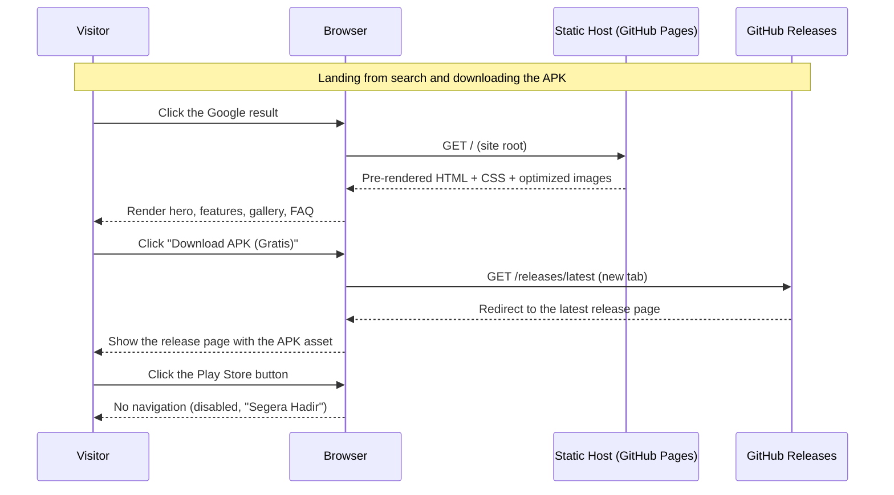
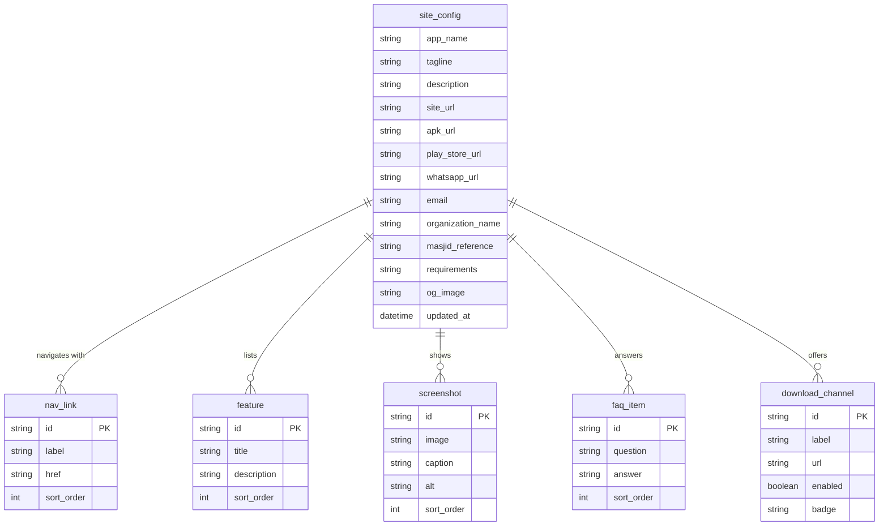

# PRD — Isyfi Pray Website (Marketing & Download Site)

## 1. Overview

Isyfi Pray is an always-on Android TV / Android Box / tablet app that displays the daily prayer schedule, Hijri and Gregorian dates, and a live countdown for a mosque. It runs itself 24/7 — automatic Adzan → Iqomah → Shalat transitions (with dedicated Jumat and Isyraq paths), event-image rotation, a config-fed financial report, a live Makkah stream before Maghrib, multi-TV master/follower sync, and LAN-browser configuration via a QR code. It needs no cloud account and computes prayer times fully offline.

This document specifies the **public marketing and download website** for Isyfi Pray: a static, SEO-optimized landing site in Bahasa Indonesia that lets mosque operators (DKM) discover the product through Google, understand its value in under two minutes, view real screenshots, and download the app.

The goal in one sentence: rank for Indonesian prayer-display searches and convert visitors into APK downloads — with the Google Play listing shown as "Segera Hadir" until the app is published there.

There is no login, no CMS, no backend, and no database. All page content is pre-rendered at build time from typed content files in the repository, and the site is deployed as static files.

## 2. Requirements

- **Site type:** static, content-first marketing site. No server-side rendering at request time, no user accounts, no forms that persist data, no CMS, no database, no cookies.
- **Roles:** visitors can only read pages and download the APK — there is no in-site editing or admin surface. The site owner edits the content files and configuration in the repository and deploys by pushing to `master`; that repository write access is the only privileged action.
- **Language:** Bahasa Indonesia for all visible copy (`<html lang="id">`, OG locale `id_ID`). No bilingual routes, no hreflang tags in v1.
- **Tech stack:** Astro (latest major) with `output: 'static'`, TypeScript, Tailwind CSS, and Astro content collections for structured content. Node.js 22 with npm. No client-side UI framework (React/Vue/Svelte) — the only shipped JavaScript is Astro's default behaviour plus one small script for the mobile menu.
- **Repository layout:** the site lives in a new top-level `website/` directory of the `isyfi-pray` repository. Source screenshots are copied from `/screenshots` into `website/src/assets/screenshots/` during implementation (see Core Feature 3 for the exact mapping). The Flutter app code is not modified by this project.
- **Hosting & deployment:** GitHub Pages, deployed by a GitHub Actions workflow on every push to `master` that touches `website/**`. The build output is the static `website/dist/` directory. A custom domain is expected later; until then the site may be served from a GitHub Pages project sub-path, and every internal link must go through `import.meta.env.BASE_URL` so it works under both.
- **Single source of truth for owner values:** all owner-supplied values (site URL, APK link, Play Store URL, WhatsApp, email, organization name, app requirements text) live **only** in `website/src/data/site.ts` with the field names defined in Section 6. No other file may hardcode them. Fields that are not yet available ship as empty strings; the UI rule for each empty field is specified in Core Feature 4.
- **Download channels:**
  - Primary (active now): direct APK from GitHub Releases latest — `https://github.com/Isyfi-Media-Tekno/isyfi-pray/releases/latest`. Opens in a new tab (`rel="noopener"`).
  - Secondary (not yet available): Google Play. While `playStoreUrl` is empty the button is rendered disabled with the label "Segera Hadir di Play Store" and `aria-disabled="true"`. As soon as the URL is set, the same component renders it as an active link with no layout change.
- **SEO:** server-rendered (build-time) HTML for all primary content, one `<h1>` per page, semantic landmarks, unique title and meta description per page, canonical URL, Open Graph + Twitter cards, JSON-LD structured data, `sitemap.xml`, `robots.txt`, descriptive alt text on every image, and the Indonesian keyword set defined in Core Feature 5.
- **Performance:** Lighthouse (mobile) ≥ 95 for Performance, Accessibility, Best Practices, and SEO; LCP ≤ 2.5 s on a simulated 4G connection; CLS < 0.1; total shipped JavaScript ≤ 40 KB gzip; no third-party scripts, no external font CDN.
- **Accessibility:** WCAG 2.1 AA colour contrast, visible focus states, a "Lewati ke konten" skip link, keyboard-operable menu, `prefers-reduced-motion` respected.
- **Analytics & tracking:** none in v1 — no Google Analytics, no pixels, no cookies, therefore no cookie banner. If analytics is added later it must be consent-gated before any script loads.
- **Maintenance:** adding or reordering a feature card, FAQ item, or screenshot requires editing a content file only — no layout code changes.
- **No invented contact data:** the contact block renders only when `whatsappUrl` or `email` is non-empty. Placeholder values must never be committed as if they were real.

## 3. Core Features

Numbered in dependency order (later features read values produced by earlier ones).

1. **Astro project scaffold & content model**
   - New `website/` directory initialized as an Astro + TypeScript + Tailwind project with `npm run dev`, `npm run build`, and `npm run preview` scripts.
   - `website/src/data/site.ts` exports a typed `siteConfig` object with exactly these fields: `appName`, `tagline`, `description`, `siteUrl`, `apkUrl`, `playStoreUrl`, `whatsappUrl`, `email`, `organizationName`, `masjidReference`, `requirements`, `ogImage` (see Section 6 for types and defaults).
   - Astro content collections under `website/src/content/` with Zod schemas in `website/src/content.config.ts`: `features`, `screenshots`, `faqs` (JSON files, each entry has `sortOrder`; see Section 6).
   - Navigation links (`Beranda`, `Fitur`, `Tangkapan Layar`, `Cara Pasang`, `FAQ`, `Unduh`) are declared once in `website/src/data/navigation.ts` and rendered by both the header and footer.
   - `BaseLayout.astro` renders `<html lang="id">`, charset, viewport, title, meta description, canonical, OG/Twitter tags, JSON-LD slots, favicon, and the skip link; every page uses it.
   - Global styles define the design tokens from Section 7 (light theme, green accent) and base typography.
   - Shared components: `Header.astro` (logo, anchor nav, small download button, mobile hamburger that toggles a menu without a framework), `Footer.astro` (brand line, nav links, contact block when configured, copyright `© {year} {organizationName}`), `Section.astro` (consistent vertical rhythm and heading anchor ids), `Button.astro` (variants: `primary`, `secondary`, `disabled`).

2. **Landing page (`/`)** — single page with these sections in order:
   1. **Hero** — badge "Gratis untuk masjid", `<h1>` "Display Jadwal Sholat Digital untuk TV Masjid", subheadline "Isyfi Pray menghitung jadwal sholat secara akurat di perangkat dengan metode Kemenag atau Muhammadiyah, lalu menjalankan tampilan Adzan, Iqomah, dan Shalat secara otomatis. Sekali pasang, berjalan 24/7 tanpa dioperasikan.", primary button "Download APK (Gratis)" → `apkUrl`, secondary button → Play Store ("Segera Hadir di Play Store"), requirements line from `requirements`, and the Home screenshot in a 16:9 rounded frame.
   2. **Masalah → Solusi** — two short columns: the manual problems (jadwal ditempel/ubah tiap hari, lupa mematikan HP saat sholat, laporan kas tidak transparan) and how Isyfi Pray removes each one. Reference line `masjidReference` when non-empty.
   3. **Fitur Unggulan** — responsive 3-column grid rendered from the `features` collection (exact seed content in the table below).
   4. **Tangkapan Layar** — gallery rendered from the `screenshots` collection; each image is a keyboard-focusable card with a caption; clicking opens the full-size image in a new tab (no JS lightbox in v1).
   5. **Cara Pasang** — numbered 3 steps: (1) "Unduh APK di halaman ini dan pasang di Android TV, Android Box, atau tablet." (2) "Hubungkan perangkat ke Wi-Fi yang sama dengan HP atau laptop Anda." (3) "Buka QR di layar TV, pindai dari HP, lalu atur nama masjid, lokasi, dan tampilan langsung dari browser tanpa aplikasi tambahan."
   6. **Multi-TV & Offline** — two side-by-side cards: master/follower sync ("Satu TV master, TV lain follower. Perubahan dari browser master otomatis tersinkron setiap 30 detik") and offline operation ("Jadwal sholat dihitung di perangkat. Tanpa internet pun tetap berjalan; hanya siaran Live Makkah dan sinkronisasi antar-TV yang butuh jaringan").
   7. **FAQ** — rendered from the `faqs` collection as native `
/
` accordions (no JavaScript), seed content in the table below.
   8. **Unduhan akhir** — repeated primary/secondary buttons, app requirements, a note "Tombol Play Store akan aktif setelah aplikasi terbit.", and a "Butuh bantuan pemasangan?" contact button shown only when `whatsappUrl` is non-empty.
   9. **Footer** — logo, nav, contact, link to `/kebijakan-privasi`, copyright.
   - Seed `features` content (title — description):
     1. Jadwal sholat akurat — Dihitung di perangkat dengan metode Kemenag, Muhammadiyah, atau kustom, plus ihtiyat dan koreksi elevasi.
     2. Kalender Hijriah Umum & KHGT — Tanggal Hijriah dengan pilihan Kalender Hijriah Global Tunggal (KHGT), atau kalender Hijriah dengan koreksi tanggal sesuai kebutuhan.
     3. Otomatis Adzan, Iqomah, dan Shalat — Transisi layar penuh tepat pada waktunya, lengkap dengan hitung mundur dan penanda waktu.
     4. Layar Jumat & Isyraq — Alur khusus hari Jumat (tanpa iqomah) dan pengingat Isyraq setelah Syuruq.
     5. Running text & latar kustom — Teks berjalan, latar belakang, dan hingga 10 gambar acara diputar otomatis di sela jadwal.
     6. Laporan kas masjid — Saldo kas dan pemasukan pekan ini tampil sebagai kartu laporan keuangan di sela jadwal sholat.
     7. Live Makkah — Siaran langsung Masjidil Haram menjelang Maghrib (butuh internet).
     8. Multi-TV master-follower — Satu konfigurasi untuk banyak layar, tersinkron otomatis.
     9. Atur dari browser — Pindai QR di layar TV, atur semuanya dari HP atau laptop di Wi-Fi yang sama.
   - Seed `faqs` content (question — answer):
     1. Apakah Isyfi Pray gratis? — Ya. Tidak ada biaya langganan dan tidak ada akun yang perlu dibuat.
     2. Apakah butuh internet? — Tidak untuk jadwal sholat. Jadwal dihitung di perangkat. Hanya Live Makkah dan sinkronisasi antar-TV yang memerlukan jaringan.
     3. Metode perhitungan apa yang tersedia? — Kemenag, Muhammadiyah, atau kustom, lengkap dengan ihtiyat dan koreksi elevasi.
     4. Bagaimana kalender Hijriahnya? — Tersedia kalender Hijriah Umum dan Kalender Hijriah Global Tunggal (KHGT). Koreksi tanggal dapat diatur sesuai kebutuhan.
     5. Bagaimana cara mengatur TV? — Pindai QR yang tampil di layar TV dari HP atau laptop di Wi-Fi yang sama. Editor pengaturan akan terbuka di browser.
     6. Apakah bisa dipakai di beberapa TV? — Bisa. Satu TV diatur sebagai master, TV lain sebagai follower dan tersinkron otomatis setiap 30 detik.
     7. Apakah sudah tersedia di Play Store? — Belum. Untuk sekarang, unduh APK dari tombol di halaman ini; tombol Play Store akan aktif setelah aplikasi terbit.
     8. Perangkat apa yang didukung? — Android TV, Android Box, dan tablet Android (mode lanskap).

3. **Screenshot pipeline**
   - Copy exactly these files from `/screenshots` (source names) to `website/src/assets/screenshots/` (target names):
     | Source file | Target file | Caption | Alt text |
     |-------------|-------------|---------|----------|
     | `Isyfi Pray - Home.jpg` | `home.jpg` | Tampilan utama | Jam digital, tanggal Hijriah dan Masehi, jadwal sholat, dan running text |
     | `Isyfi Pray - Waktu Adzan.jpg` | `adzan.jpg` | Waktu adzan | Layar waktu adzan berkumandang untuk sholat Maghrib |
     | `Isyfi Pray - Iqamah.jpg` | `iqamah.jpg` | Menuju iqomah | Layar hitung mundur menuju iqomah dengan pengingat meluruskan shaf |
     | `Isyfi Pray - Shalat Berlangsung.jpg` | `shalat.jpg` | Shalat berlangsung | Layar shalat berlangsung dengan hadits tentang meluruskan shaf |
     | `Isyfi Pray - Waktu Isyraq.jpg` | `isyraq.jpg` | Waktu isyraq | Layar menanti isyraq setelah syuruq |
     | `Isyfi Pray - Financial Report.jpg` | `laporan-keuangan.jpg` | Laporan kas masjid | Layar laporan keuangan masjid: saldo kas dan pemasukan pekan ini |
     | `Isyfi Pray - Live Makkah.jpg` | `live-makkah.jpg` | Live Makkah | Layar siaran langsung Masjidil Haram sebelum waktu Maghrib |
   - Render every screenshot with Astro's `<Image>` component: `format="webp"`, responsive `widths` (480/768/1200), explicit `width` and `height` attributes, `loading="lazy"` for everything below the hero (the hero image uses `loading="eager"` and `fetchpriority="high"`).
   - Keep the original JPGs out of `public/` — they must flow through the image optimizer.

4. **Download channels component (`DownloadButtons.astro`)**
   - Accepts a `size` prop (`md` for hero/final CTA, `sm` for the header).
   - Primary button: label "Download APK (Gratis)", `href={siteConfig.apkUrl}`, `target="_blank"`, `rel="noopener"`.
   - Secondary button logic: if `playStoreUrl` is empty render `<button disabled aria-disabled="true">Segera Hadir di Play Store</button>` with the `disabled` style variant and the Play icon; otherwise render it as a normal external link with label "Unduh di Google Play". This is a build-time branch, no runtime JavaScript.
   - Below the buttons (md size only) render `siteConfig.requirements` and the free/subscription line "Gratis — tanpa langganan, tanpa akun".

5. **SEO infrastructure**
   - Per-page values (exact strings):
     - `/` title: `Display Jadwal Sholat Digital untuk TV Masjid | Isyfi Pray` (58 chars). Description: `Aplikasi jam sholat digital untuk Android TV dan tablet. Jadwal Kemenag atau Muhammadiyah dihitung offline, layar Adzan, Iqomah, dan Shalat otomatis. Gratis.`
     - `/kebijakan-privasi` title: `Kebijakan Privasi | Isyfi Pray`. Description: `Bagaimana Isyfi Pray menjaga data Anda: tanpa akun, tanpa pelacakan, dan konfigurasi tersimpan di perangkat masjid.`
   - Canonical `<link>` on every page: `new URL(path, siteConfig.siteUrl)`; when `siteUrl` is empty the canonical tag is omitted rather than rendered with a broken value.
   - Open Graph + Twitter: `og:type=website`, `og:locale=id_ID`, `og:title`, `og:description`, `og:url`, `og:image` = `ogImage` (1200×630 PNG in `public/`, composed from the hero screenshot and the logo), `twitter:card=summary_large_image`.
   - JSON-LD on `/` (one `<script type="application/ld+json">` per type, values interpolated from `siteConfig` and content collections):
     - `SoftwareApplication`: `name`, `description`, `applicationCategory: "LifestyleApplication"`, `operatingSystem: "Android"`, `downloadUrl: apkUrl`, `offers: { "@type": "Offer", price: "0", priceCurrency: "IDR" }`, `screenshot` (array of absolute screenshot URLs), `publisher: { "@type": "Organization", name: organizationName }`; include `installUrl: playStoreUrl` only when non-empty.
     - `WebSite`: `name`, `url`.
     - `Organization`: `name`, `url`, `logo`.
     - `FAQPage`: generated from the `faqs` collection (`mainEntity` with `Question`/`Answer` per item).
   - Sitemap: `@astrojs/sitemap` integration writes `sitemap-index.xml` + `sitemap-0.xml` with absolute URLs from `siteUrl`; `public/robots.txt` allows all and appends `Sitemap: {siteUrl}/sitemap-index.xml` (the robots file is replaced at build time if a `siteUrl`-aware generator is simpler).
   - Keyword set to integrate naturally (title, `<h1>`, `<h2>`, first paragraph, image alt text, FAQ): `jam sholat digital`, `display jadwal sholat masjid`, `TV masjid`, `aplikasi jam sholat Android TV`, `jadwal sholat otomatis`, `running text masjid`, `laporan kas masjid`, `metode Kemenag`, `Muhammadiyah`, `KHGT`.
   - All primary content is present in the pre-rendered HTML source (verify by disabling JavaScript: the hero, features, gallery, FAQ answers must all be readable).

6. **Legal page (`/kebijakan-privasi`)**
   - Indonesian privacy policy as static content covering, in order: data that is **not** collected (no account, no personal data, no location sent to a server); what stays on the device (prayer settings and uploaded images in local storage); network usage (Live Makkah loads YouTube and is subject to Google's privacy policy; follower sync talks only to the master TV on the same LAN); website cookies (none); contact (`email`, or the contact section omitted when empty).
   - `BaseLayout` with the same header/footer; `noindex` is **not** set (the page should rank for "kebijakan privasi isyfi pray").

7. **404 page (`/404`)**
   - Static Astro 404 page: short Indonesian message "Halaman tidak ditemukan", a link back to `/`, and the download button. Rendered in the same layout.

8. **Deployment pipeline**
   - `.github/workflows/website.yml`: triggers on `push` to `master` with paths `website/**` and on `workflow_dispatch`; steps: checkout, setup Node 22 with npm cache, `npm ci --prefix website`, `npm run build --prefix website`, configure GitHub Pages, upload `website/dist` as the Pages artifact, deploy.
   - Repository Pages setting: "GitHub Actions" as the source.
   - One-time owner step (documented in `website/README.md`): set the real `siteUrl` in `src/data/site.ts` (and, for a project sub-path, Astro's `site`/`base` config) before the first production deploy so canonical URLs and the sitemap are correct.

**Out of scope for v1 (do not build):** blog, documentation site, multi-language routes, CMS/admin UI, newsletter, analytics, payment or donation flow, user accounts, server-side rendering, comments, light/dark theme toggle (the site is light-only), interactive screenshot lightbox.

## 4. User Flow

Primary user: a mosque operator (DKM) looking for a digital prayer display. Secondary: the site owner maintaining content.

1. **Discovery:** Operator searches Google for "display jadwal sholat masjid android tv". The `/` page appears with its Indonesian title and description; they click it.
2. **Landing:** The pre-rendered page loads (fast, no loading spinner). The hero states what Isyfi Pray is, shows the Home screenshot, and offers two buttons: "Download APK (Gratis)" and a disabled "Segera Hadir di Play Store".
3. **Evaluation:** Operator scrolls through Masalah → Solusi, the feature grid, and the screenshot gallery; opens one screenshot full-size to check readability; reads two or three FAQ entries.
4. **Download:** Operator clicks "Download APK (Gratis)" → GitHub Releases latest opens in a new tab → downloads the APK asset. If they instead click the Play Store button, it is visibly disabled with the "Segera Hadir" label and does not navigate.
5. **Contact (optional):** If `whatsappUrl` is configured, the final CTA shows "Butuh bantuan pemasangan?" → opens WhatsApp with a prefilled message. If not configured, the block is absent.
6. **Install (off-site):** Operator installs the APK and configures the TV via the in-app QR flow — the website only links to the download; it does not document the full app configuration.
7. **Owner update:** Owner edits `src/data/site.ts` (e.g. sets `playStoreUrl` when the app is published) or a content JSON file (e.g. adds a feature), commits to `master`; the Actions workflow rebuilds and redeploys; the Play Store button becomes an active link, and the JSON-LD `installUrl` appears.

## 5. Architecture

Sequence diagram for the most important transaction: a visitor arriving from Google and downloading the APK. It matches User Flow steps 1–4.

Related flows on the same static stack: the owner's content update (edit file → push to master → GitHub Actions builds `website/dist` from the same content files → Pages deploys), and the legal page (same host, same layout, no JavaScript).

## 6. Database Schema

There is no database and no runtime persistence. The two stores are (a) `website/src/data/site.ts` for owner-supplied configuration and `website/src/data/navigation.ts` for nav links, and (b) Astro content collections under `website/src/content/` (`features.json`, `screenshots.json`, `faqs.json`) validated by Zod at build time. The ERD below models these as logical tables so every Core Feature maps to a content source; `FK` marks values read from the shared `site_config` rather than repeated.

| Table | Description |
|-------|-----------|
| **site_config** | Typed `siteConfig` object in `src/data/site.ts`. Ships with: `appName "Isyfi Pray"`, `apkUrl "https://github.com/Isyfi-Media-Tekno/isyfi-pray/releases/latest"`, `organizationName "Isyfi Media Tekno"`, `ogImage "/og-default.png"`, `masjidReference "Digunakan di berbagai masjid di Indonesia"`, `requirements "Android TV, Android Box, atau tablet Android • Lanskap 16:9"`; `siteUrl`, `playStoreUrl`, `whatsappUrl`, `email` are empty strings until the owner fills them. |
| **nav_link** | Typed array in `src/data/navigation.ts` rendered by header and footer; `href` values are in-page anchors (`#fitur`, `#tangkapan-layar`, `#cara-pasang`, `#faq`, `#unduh`) or routes (`/`, `/kebijakan-privasi`). Internal hrefs are prefixed with `import.meta.env.BASE_URL`. |
| **feature** | `src/content/features.json` — one entry per Core Feature 2 seed card (`id`, `title`, `description`, `sortOrder`). |
| **screenshot** | `src/content/screenshots.json` — one entry per Core Feature 3 table row (`id`, `image` = import key, `caption`, `alt`, `sortOrder`); the hero image is the `home` entry, not a separate field. |
| **faq_item** | `src/content/faqs.json` — one entry per Core Feature 2 FAQ seed item; also drives the `FAQPage` JSON-LD. |
| **download_channel** | Derived at build time, not stored: one primary channel from `siteConfig.apkUrl` (always `enabled: true`) and one Play Store channel from `siteConfig.playStoreUrl` (`enabled` = URL non-empty, `badge` = "Segera Hadir" when disabled). |

Features that need no persistence: the rendered pages themselves (built into `website/dist/`), the OG image and favicons (static files in `public/`), the sitemap (generated at build time), the 404 page, and the deployment workflow (a repository file; GitHub Pages holds the build artifact, not application data).

## 7. Design & Technical Constraints

1. **High-Level Technology:**
   - Astro (latest major) with `output: 'static'`, TypeScript strict mode, Tailwind CSS wired through Astro's Vite config, and `@astrojs/sitemap`. Node 22, npm, no other UI framework.
   - Content collections use Astro's `file()` loader with Zod schemas; a schema violation fails the build (content errors must never reach production).
   - JavaScript budget: Astro ships zero JS by default; the only script is the header's mobile-menu toggle (vanilla JS, ≤ 1 KB). No `client:*` directives.
   - Forms, if any appear later, must not submit anywhere in v1.
   - Reliability: the site must be fully usable with JavaScript disabled and with images blocked (alt text carries meaning).
2. **Typography / Design Tokens:**
   - Light-only, per the approved mockups in `mockups/website-light/` (this supersedes the original dark/amber palette): page background `#F8FAF9`, surface `#FFFFFF`, border `#E4EAE6`, body text `#0F172A`, muted text `#64748B`, primary green `#15803D` (hover `#166534`) for CTAs, soft green `#DCFCE7` for icon tiles, green accent `#16A34A` (checkmarks/status), danger `#DC2626` (not used for CTAs). Buttons are pill-shaped (`border-radius: 9999px`).
   - Font: Plus Jakarta Sans variable, self-hosted via `@fontsource-variable/plus-jakarta-sans` (latin subset), weights 400/500/700/800. Fallback stack: `system-ui, -apple-system, "Segoe UI", sans-serif`.
   - Type scale (desktop): hero `clamp(2.25rem, 5vw, 4rem)` / 800 weight / 1.1 line-height; section headings `clamp(1.5rem, 3vw, 2.25rem)`; body 1.0625 rem / 1.7. Mobile-first layout; content max width 1120 px; section padding 96 px desktop, 64 px mobile.
   - Icons: `astro-icon` with the Lucide set, rendered inline at build time (no runtime icon font).
   - Screenshots are presented in rounded 16:9 cards with a 1 px `#E4EAE6` border and no drop shadow; the app screenshots themselves are dark, contrasting against the light page.
3. **Required Integrations:**
   - GitHub Pages (hosting) + GitHub Actions (build/deploy) — both free, already available on the repository's GitHub organization.
   - GitHub Releases — the current APK source; the site links only, it does not download or mirror APKs.
   - Google Play — linked only, disabled until the listing exists.
   - No analytics, no cookie tooling, no external font or script CDN in v1.

---

*Source-grounding notes (for reviewers): this PRD specifies the public website, not the Android app — the app spec remains in `PRD/PRD-jam-sholat-tv.md`. Feature and FAQ copy is derived from that PRD and the running app (`lib/ui/`, `lib/app/providers/app_provider.dart`). Screenshot sources are the seven JPGs in `/screenshots` (see the mapping table in Core Feature 3). The direct download URL uses the repository's GitHub Releases (`Isyfi-Media-Tekno/isyfi-pray`); the Play Store URL, custom domain, and contact channels are owner-supplied values that ship empty and are read only from `src/data/site.ts`. The visual design follows the approved light/green mockups in `mockups/website-light/` (the original dark/amber tokens in Section 7.2 were superseded).*
